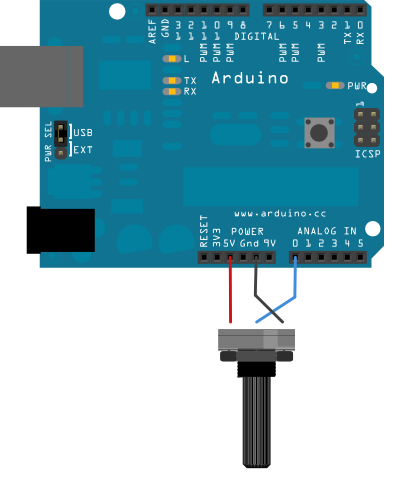

# Career Day for Girls 2020!

## Introduction
We're excited to get to play with some robotics with all of ya'll over the next 30 minutes. However, that's not a lot of time. We will  use this repository to outline what we want to get done today and hopefully as a reference for you in the future to look back on.

## Resources
We will be using an Arduino Nano today as our microprocessor. It is a low cost, super functional and easy to interface 'mini computer'. I like to think of it as the 'brain' of my project. The awesome thing about Arduino is that millions of people like you and me use it and there is almost infinite documentation online about how to do so (see **Reference Links** below)

## Setup
1. Plug your board into your computer
2. Open Arduino IDE
	1. Under Tools>Board> select "Arduino Nano"
	2. Under Tools>Port> select the one that says Arduino
	3. Under Tools>Processor> select Atmega328p (old bootloader)
3. [UPDATE POST CDFG 2020] Thank you all for being so awesome! Hoepfully you want to continue working on this at home, to do so you need to install the driver the lets your computer talk to this specific Arduino:
http://www.rexqualis.com/download/, that can be found here and downloaded when you click the "REXQualis Nano Instruction and CH340 Driver"
4. If yall have literally any questions feel free to contact we at JoshC@u.northwestern.edu 

## Challenges 

### LED | Button Blink

1. Wire up your LED and button as shown here!
2. Talk through the code with your partner
3. Run it!

### LED | Button AND
1. Wire up another button (look at how the first is wired)
2. Write code so that your LED lights up when button_1 AND (&&) button_2 are pushed
	* HINT: you'll probably have to definen another input
	* HINT: the logical and symbol in the c programming language looks like this : &&

### LED | Potentiometer

1. Wire up the potentiometer as shown in the image above 
2. Up to you!
	* maybe light your LED up proportional to how much you twist the knob?
	* have the LED turn on when you twist the knob a certain amount

### LED | Potentiometer | Button AND
1. Now see if you can make a logical combination of both the LED and potentiometer and button!
2. Maybe there's only a secret combination of button presses and potentiometer values that will light up your LED

Wow! Wouldn't it be easier if we could see what our Arduino was thinking.... 

### Serial Write!
1. A great library for having your Arduino talk back to your computer

2. Check out the awesome documentation 
	* https://www.arduino.cc/reference/en/language/functions/communication/serial/
	* or in the serial_hello_world folder
	* or search the internet for answers!

### Serial Read and more
1. Now what if we want to read in information from the computer...
2. Check out how this piece of documentation uses Serial.Available() to help with that:
	https://www.arduino.cc/reference/en/language/functions/communication/serial/available/

### Reference Links (look back on this at home!)
#### Arduino Reference
Arduino has changed the game of how we make robots in the past 10 (!) years. They have open sourced (made the fundamental building blocks of their products freely available to anybody!!!) hardware in a way no one really had before. For us this means there is a HUGE community of passionate people supporting the development of cool and fun projects with Arduino. These links are a great way to start looking into Arduino but you can also google any question you have and find a world of answers.
* Here is a link to download the Arduino development enviroment at home: https://www.arduino.cc/en/Main/Software
* Here is gita there reference link to how to use Arduino functions: https://www.arduino.cc/reference/en/

#### Adafruit Reference
Adafruit is an amazing place founded by [Lady Ada](https://en.wikipedia.org/wiki/Limor_Fried) that has revolutionized the world of open source hardware. They have phenomenal documentation, project ideas, and project guides for you to follow along with. 
* A reference for a very similar board: https://www.adafruit.com/product/2590
* Link to a guide of Adafruit Neopixels, if you liked the LEDs we played with today here's a way to take it to the next level: https://learn.adafruit.com/adafruit-neopixel-uberguide
